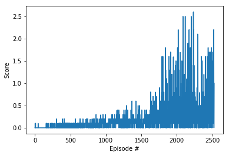
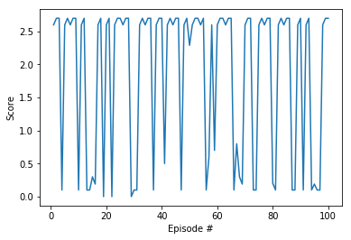

# Report

This is the detailed report on my implementation of a 2-agent variant of the deep deterministic policy gradient algorithm (DDPG) for the Tennis environment. I will just go through part 4 of the [Tennis.ipynb](Tennis.ipynb)-notebook because the learning algorithm is implemented there. Note that the learning algorithm is not precisely identical to the MADDPG algorithm for the following reasons:

* In MADDPG every actor only gets its own observations as input whereas in my implementation every actor gets all observations as input.
* In MADDPG every critic gets the actions from all agents as input whereas in my implementation every critic only gets the action from its associated agent as input.

Now to part 4:

In cell 6, in the Actor and Critic classes, the architecture of the neural networks, that will approximate optimal policies for the agents and the optimal action value functions, is defined. In the Actor class (lines 12 to 38) the structure of the neural networks for the policy functions is defined and has the following form:

* The input size will later be set to 2\*24=48 since we will input all available observations to the actor networks (cf. lines 39-40 in cell 7).
* There is one hidden layer of size 256 which is activated by the relu-function.
* The output layer is of size 2 (, which is the dimension of the action vector of an agent) and is activated by the tanh-function.

In the Critic class (lines 41 to 71) the structure of the neural networks for the action-value functions is defined and has the following form:

* There is one input layer of size 2\*24=48 (cf. lines 44-45 in cell 7; note again that we will also input all observations to the critics). The input of that layer gets sent through a hidden layer of dimension 256 and a leaky relu-function is applied afterwards.
* The result after applying the leaky-relu gets concatenated with another input layer of size 2 (=action dimension of an agent).
* The result of this concatenation gets sent through another hidden layer (of dimension 128) which again gets activated by a leaky relu function.
* The output layer has dimension 1 and no activation function is applied.

In cell 7 the Agent and ReplayBuffer classes are created, as well as the OUNoise class. But first some of the hyperparameters are fixed, namely:

* BUFFER_SIZE = 1000000   (number of stored experiences for the experience replay)
* BATCH_SIZE = 128        (batchsize of the batches that will be taken from the stored experiences during learning)
* GAMMA = 0.995            (discount rate)
* TAU = 0.01             (we will update the weights of the target network softly with factor TAU)
* LR_ACTOR = 0.0001       (learning rate for the actor neural networks)
* LR_CRITIC = 0.0003      (learning rate for the critic neural networks)
* WEIGHT_DECAY = 0  (L2 weight decay for the critics)

Then it is checked if a GPU is available and the device is set to GPU if that's the case; otherwise we will continue with CPU.  
In the Agent class (lines 22-130) there are 6 methods:  
In the \_\_init\_\_-method (lines 25-52) four neural networks are instantiated (respectively will get instantiated when an instance of type Agent gets created); two actor networks and two critic networks. Here one of the two critic networks (critic\_target) serves as the target function for the critic-learning step. One of the two actor networks (actor\_target) is used to choose the actions that will later be input into this target function for the critic-learning step. The other two networks (actor\_local and critic\_local) are the networks that later (after training) will approximate the optimal policy respectively the optimal action-value function. Furthermore the optimizers for the backward propagation steps for actor\_local and critic\_local are set to "Adam". Also the experience replay memory is initialized by creating a ReplayBuffer object and the noise that will later be added to the actions is initialized by creating an OUNoise-object.  
In the step- and learn-methods the important parts of the learning step are implemented (see lines 54-62 and 78-117): By calling the step-method the experience replay memory is updated and the learn-method gets called. By calling the learn-method forward-and backward propagation of actor\_local and critic\_local is carried out. Here the error of critic\_local is computed by using the target function critic\_target and actor\_local gets optimized by maximizing the output of critic\_local when the actions predicted by actor\_local are input into critic\_local. Furthermore - by calling the soft\_update-method - actor\_target and critic\_target get updated softly with factor TAU (implementation of the soft\_update method is in lines 119-130).  
In the act-method (see lines 64-73) the behaviour of the agent (depending on the current estimate of the optimal policy actor\_local) is defined. One can see that the agents don't exactly act as guided by actor\_local but there is a noise that is added to the output of the network.   
In the Reset-method (lines 75-76) the noise gets resetted.  
In the OUNoise class (lines 132-141) the noise that will get added to the actions when the agents act is defined.  
In the ReplayBuffer class (lines 154-189) it is defined how to add experiences to the experience replay memory (in the add-method; lines 170-173) and how randomly created batches are chosen from the memory (in the sample-method; lines 175-185).

In cell 8 two instances of the Agent class are created.

In cell 9 the ddpg()-function is defined. By calling this function the DDPG-algorithm will actually be carried out. The training loop does the following things in each episode (until either the training went on for n_episodes=50000 episodes or the goal of having an average score of +0.5 over 100 consecutive episodes is reached):
* The environment is reset.
* The noise for both agents is reset.
* In every timestep of the episode the agents act, get a reward, get a new state and the step-method is called. By calling the step-method the new experience is stored in the Repaly-Buffer and the agents learn.
* The cumulative reward that was achieved in the episode gets stored in the final\_scores-list and the final\_scores\_deque.
* The noise gets decreased by a factor of noise_decay=0.9999

The final\_scores\_deque is used to check if the goal was reached in the current episode and the final\_scores-list is used for a plot later.

The goal was reached after a total number of 2527 episodes. Since the average score over 100 consecutive episodes is checked, this means that the environment was solved after 2427 episodes. (Note however, that in training runs I did before, the goal was sometimes only reached after around 4000 or 5000 episodes.)

The achieved total reward per epsisode is plotted. This plot you can also see here: 

In cell 10 the trained agents are run for 100 more episodes in the Tennis-Environment to check their performance. The scores that were achieved in every episode are plotted. This plot you can also see here:

Furthermore the average score (over those 100 episodes) is recorded: 1.8636.

In the last cell the environment gets closed.

### Ideas for future work

I haven't really played around a lot with the hyperparameters and I would guess that there are still some possibilities to tweak them.

Furthermore one could try out to implement the MADDPG algorithm.

I have no a priori idea if MADDPG would give better performance than my variant of DDPG for the Tennis environment but at least this is definitely something one could try out.
